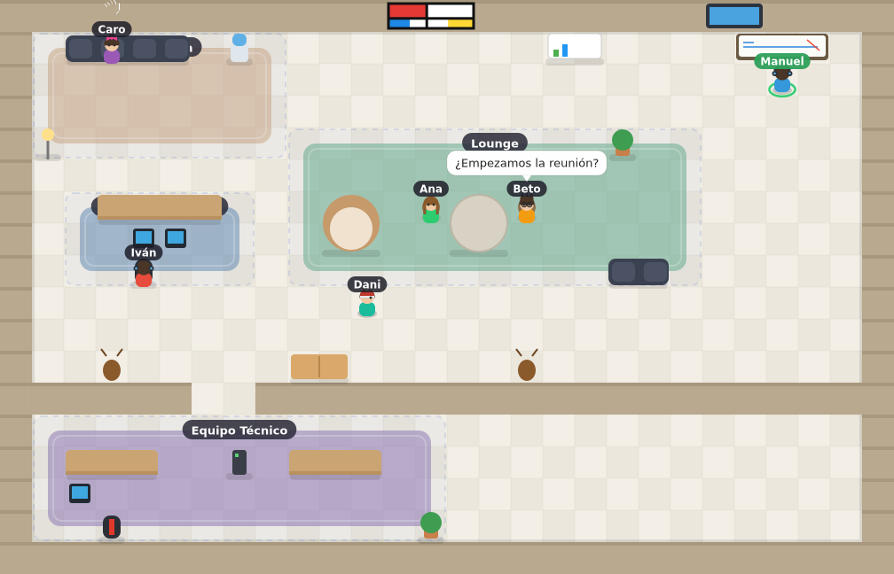

# 🏢 La Oficina de la IA — Oficina virtual multijugador (estilo Pokémon)



Una oficina virtual top-down en pixel-art, inspirada en Gather Town. Tu avatar
se mueve por la oficina tile a tile (estilo Pokémon), con colisiones contra los
muebles, zonas con nombre (Recepción, Sala de Streaming, Lounge, Equipo Técnico)
y **multijugador en tiempo real**: ves moverse al resto de personas con su
nombre encima y podéis chatear con bocadillos sobre los avatares.

## 🧱 Stack

- **Cliente:** React + Vite + `<canvas>` (motor de juego propio, sin librerías de juego).
- **Servidor:** Node.js + Express + Socket.IO (presencia, movimiento y chat en tiempo real).

## 🚀 Puesta en marcha

```bash
# 1. Instalar todas las dependencias (raíz + servidor + cliente)
npm run install:all

# 2. Arrancar servidor (puerto 3001) y cliente (puerto 5173) a la vez
npm run dev
```

Abre **http://localhost:5173** en varias pestañas o dispositivos para probar el
multijugador. Cada pestaña es un jugador distinto.

### Modo producción en local (una sola URL)

```bash
npm run build   # compila el cliente
npm start       # el servidor sirve la app en http://localhost:3001
```

## 🚀 Publicar (salir de local)

La app se despliega como **un único servicio** (el servidor sirve el cliente
compilado y el tiempo real). Guía completa en **[DEPLOY.md](./DEPLOY.md)** —
incluye Render (gratis, recomendado), Docker, Railway y cómo añadir un **TURN**
para que el vídeo funcione entre redes distintas en reuniones reales.

## ✨ Funciones

- 🧍 **Avatar personalizable**: piel, peinado, color de pelo, camiseta, gafas y
  accesorios (cascos, gorro, lazo). Editable también dentro de la oficina.
- 🪑 **Objetos interactivos**: siéntate en sillas y sofás con la tecla `E`.
- 😀 **Emotes**: reacciones flotantes sobre tu avatar (teclas `1`-`6` o la barra).
- 🎥 **Vídeo/voz por proximidad (WebRTC)**: al acercarte a alguien (≤ 4 casillas)
  se abre automáticamente la videollamada; al alejarte se cierra.
- 🖥️ **Compartir pantalla**: presenta tu pantalla a quienes tengas cerca.
- 🖌️ **Pizarra colaborativa**: dibujad juntos en tiempo real (botón «🖌️ Pizarra»
  o tecla `F` junto a la pizarra de la oficina). Quien llega tarde ve lo ya dibujado.
- 🗣️ **Indicador de "hablando"**: aro verde alrededor de quien tiene el micro
  activo y está hablando.
- 🪑 **Salas de reunión con audio de grupo**: dentro de una misma sala (Recepción,
  Streaming, Lounge, Equipo Técnico) os oís todos aunque os mováis, no sólo por
  distancia. Cada sala tiene su alfombra.
- 🔄 **Reconexión automática**: si se cae la red, vuelves a entrar solo.
- 💾 **Perfil recordado**: tu nombre y avatar se guardan en el navegador.
- 🟢 **Contador de gente en línea** en la cabecera.

## 🎮 Controles

- **Moverte:** `WASD` o flechas `⬆️ ⬇️ ⬅️ ➡️` (también hay un D-pad táctil en pantalla).
- **Sentarte/levantarte:** `E` cuando estés junto a una silla o sofá.
- **Pizarra:** `F` junto a la pizarra (o el botón «🖌️ Pizarra» del HUD).
- **Emotes:** teclas `1`-`6` o la barra inferior de emojis.
- **Chatear:** escribe en la caja inferior y pulsa Enter; tu mensaje aparece como
  bocadillo sobre tu avatar durante 5 segundos.
- **Voz/vídeo:** botón «🎙️ Activar voz/vídeo por proximidad» (arriba a la derecha).
- **Compartir pantalla:** botón «🖥️» en los controles de vídeo.

## 🗺️ ¿Cómo está organizado?

```
server/
  index.js          # Servidor Socket.IO: join / move / chat / disconnect
client/
  src/
    socket.js        # Cliente Socket.IO
    App.jsx          # Pantalla de juego, HUD y D-pad táctil
    components/
      JoinScreen.jsx # Entrada: nombre + color de avatar
      Chat.jsx       # Caja de chat y registro de mensajes
    game/
      mapData.js     # Mapa de la oficina: tiles, muebles y zonas
      render.js      # Dibujo de suelo, muebles y avatares en canvas
      OfficeCanvas.jsx # Bucle del juego, movimiento y red
```

## ✏️ Personalizar la oficina

Edita `client/src/game/mapData.js`:

- **`FURNITURE`**: añade/quita muebles `{ x, y, w, h, kind, solid }` (coordenadas en tiles).
  `solid: true` hace que bloqueen el paso. Los `kind` disponibles están en `render.js`.
- **`ZONES`**: rectángulos con nombre que etiquetan los espacios.
- **`TILE`, `COLS`, `ROWS`**: tamaño de celda y dimensiones del mapa.

## 🛣️ Siguientes pasos (ideas)

- Vídeo/voz por proximidad con WebRTC (al acercarte a alguien se abre la llamada).
- Sprites de pixel-art reales en lugar de avatares dibujados con canvas.
- Salas privadas, objetos interactivos (pizarra, pantallas) y persistencia.
